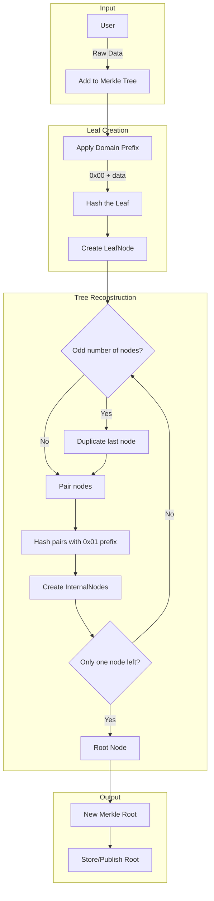
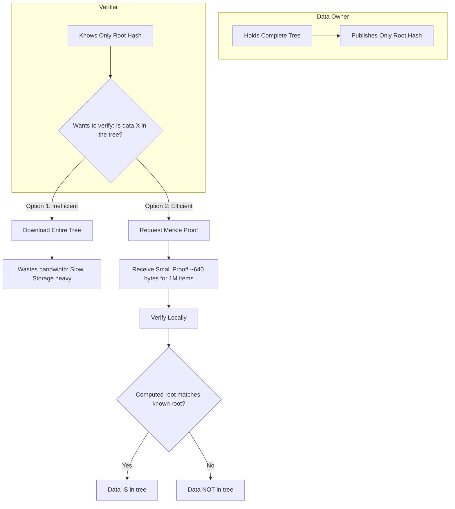
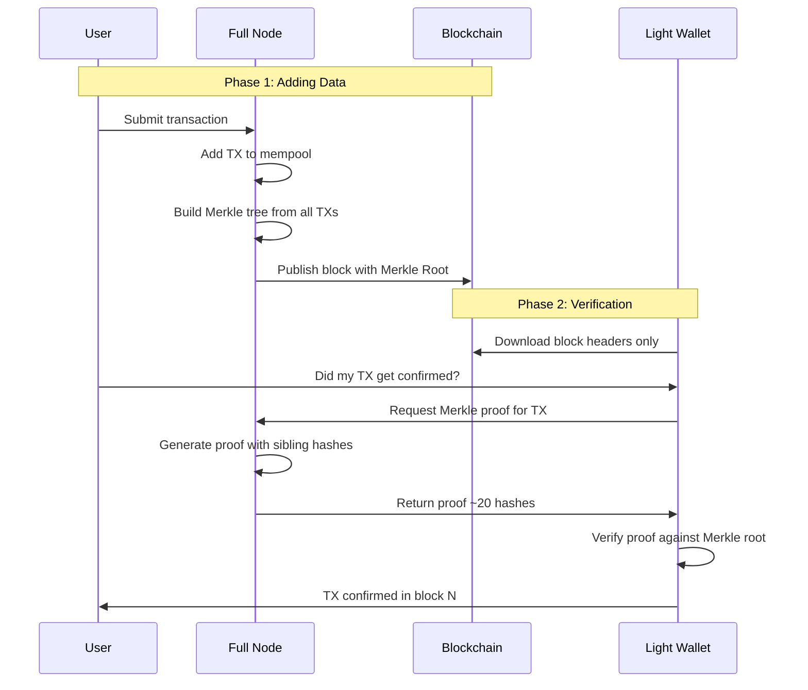
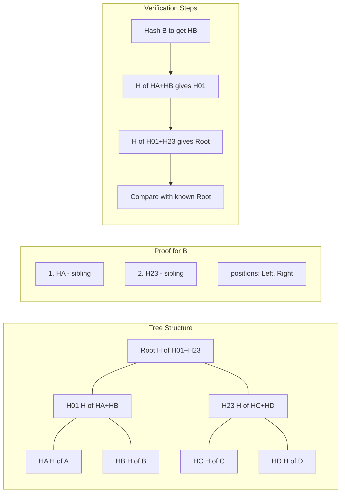
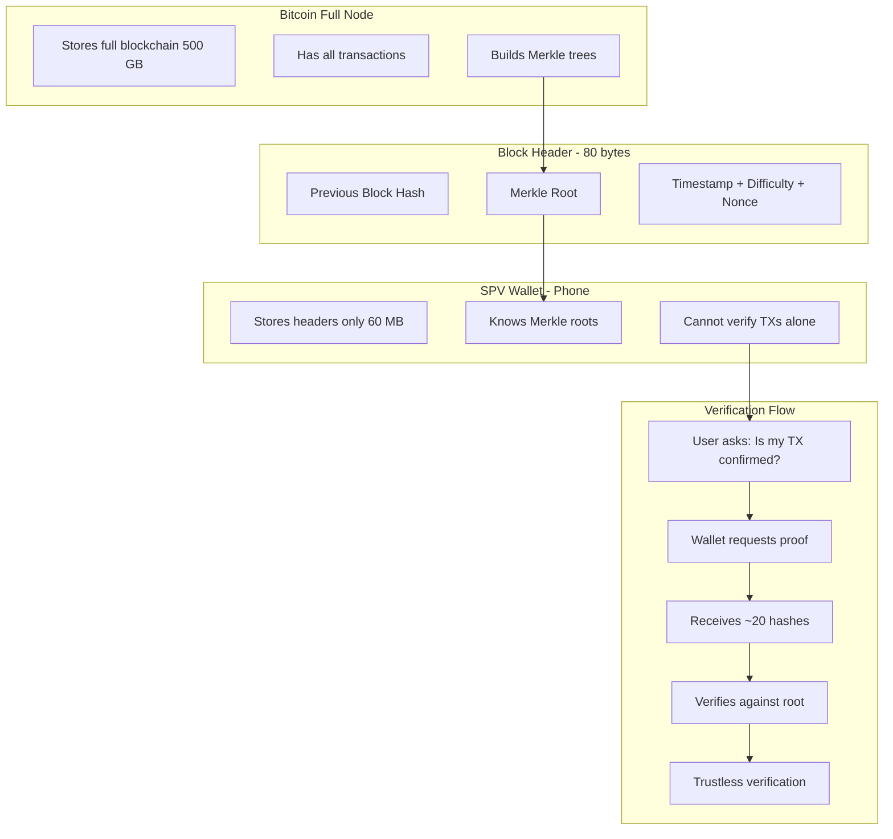

# Merkle Trees

[](https://github.com/deruelle/merkle-trees/actions/workflows/rust.yml)
[](https://codecov.io/github/deruelle/merkle-trees)

A production-quality Merkle tree implementation in Rust, built as a learning
project to explore the language through a data structure fundamental to
blockchain technology.

## Table of Contents

- [Features](#features)
- [Quick Start](#quick-start)
- [How Merkle Trees Work](#how-merkle-trees-work)
- [Merkle Proofs](#merkle-proofs)
- [Architecture](#architecture)
- [Development](#development)
- [Contributing](#contributing)

## Features

- **Pluggable hash algorithms** via the `Hasher` trait (SHA-256 included)
- **Merkle proof generation and verification** for efficient data integrity checks
- **Domain separation** to prevent collision attacks
- **Memory-efficient design** using `Arc` for node sharing
- **Zero-copy hash access** for optimal performance

## Quick Start

```rust
use merkle_trees::{SimpleMerkleTree, MerkleTree, Sha256Hasher};

// Create a new tree with SHA-256 hashing
let mut tree = SimpleMerkleTree::new(Sha256Hasher::new());

// Add data to the tree
tree.add_leaf(b"transaction1")?;
tree.add_leaf(b"transaction2")?;
tree.add_leaf(b"transaction3")?;

// Get the Merkle root (hex string)
let root = tree.get_root();

// Generate a proof for a specific leaf (index 0)
let proof = tree.prove(0)?;

// Verify the proof against the expected root
let expected_root = tree.get_root_bytes().unwrap();
let is_valid = tree.verify(&proof, b"transaction1", &expected_root);
```

## How Merkle Trees Work


A Merkle tree is a hash-based data structure where:

- Every **leaf node** contains hashed data
- Every **internal node** contains the hash of its children
- The **root hash** represents the entire dataset

A tree with *n* leaves has height log₂(n), making verification extremely efficient.

### Design Invariants

| Invariant        | Implementation                       |
| ---------------- | ------------------------------------ |
| Leaf hashing     | `H(0x00 \|\| data)`                  |
| Internal hashing | `H(0x01 \|\| left \|\| right)`       |
| Odd node count   | Duplicate the last node              |
| Empty input      | Return `MerkleTreeError::EmptyInput` |
| Hash size        | Always 32 bytes                      |

The domain separation prefixes (`0x00` for leaves, `0x01` for internal nodes)
prevent second-preimage attacks where different tree structures could produce
identical roots.

## Merkle Proofs

A **Merkle proof** (or inclusion proof) allows you to prove that specific data
exists in the tree **without revealing the entire tree**. You only need the
sibling hashes along the path from the leaf to the root — O(log n) hashes.

### Adding Data to the Tree



### When Proofs Are Needed



### Blockchain Transaction Lifecycle



### Proof Structure

For a tree with 8 leaves, proving leaf "B" requires siblings along the path:



### Efficiency Comparison


### Real-World Example: Bitcoin SPV



## Architecture

```text
src/
├── hasher/              # Pluggable hash algorithms
│   ├── mod.rs           # Hasher trait definition
│   ├── sha256.rs        # Production SHA-256 hasher
│   └── simple.rs        # Test hasher (for debugging)
├── merkle/              # Tree structure
│   ├── mod.rs           # Public API and MerkleTree trait
│   ├── hash.rs          # Hash trait (for types that have a hash)
│   ├── node.rs          # Node enum (Leaf or Internal)
│   ├── leaf_node.rs     # Leaf node (contains raw data)
│   ├── internal_node.rs # Internal node (has two children)
│   └── simple_tree.rs   # SimpleMerkleTree implementation
└── lib.rs               # Public API exports
```

### Key Design Decisions

- **Strategy pattern** for hashing allows swapping algorithms without changing
  tree logic
- **`Arc<Node>`** enables cheap cloning during tree reconstruction
- **Raw byte arrays** (`[u8; 32]`) instead of hex strings for memory efficiency
- **`&[u8]` returns** from hash methods eliminate unnecessary allocations

## Development

### Prerequisites

For faster linking times, install mold:

```bash
sudo apt-get install clang mold
```

### Build and Test

```bash
cargo build              # Build the project
cargo test               # Run all tests
cargo test test_name     # Run a specific test
```

### Watch Mode

```bash
cargo install cargo-watch
cargo watch -x check -x test
```

### Code Coverage

```bash
rustup component add llvm-tools-preview
cargo install cargo-llvm-cov
cargo llvm-cov           # Generate coverage report
```

## Contributing

This project uses [OpenSpec](https://github.com/deruelle/openspec) for
spec-driven development of new features.

### When to Create a Proposal

Create an OpenSpec proposal for:

- New features or capabilities
- Breaking changes to the API
- Architecture changes
- Performance optimizations that change behavior

Skip proposals for:

- Bug fixes
- Documentation updates
- Dependency updates (non-breaking)

### Workflow

1. Review existing specs: `openspec list --specs`
2. Check active changes: `openspec list`
3. Create a proposal in `openspec/changes/<change-id>/`
4. Get approval before implementing
5. Archive after deployment

See `openspec/AGENTS.md` for detailed instructions.

## License

MIT
