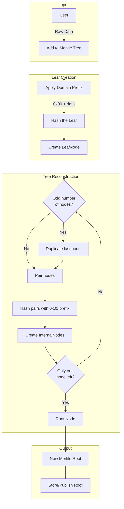
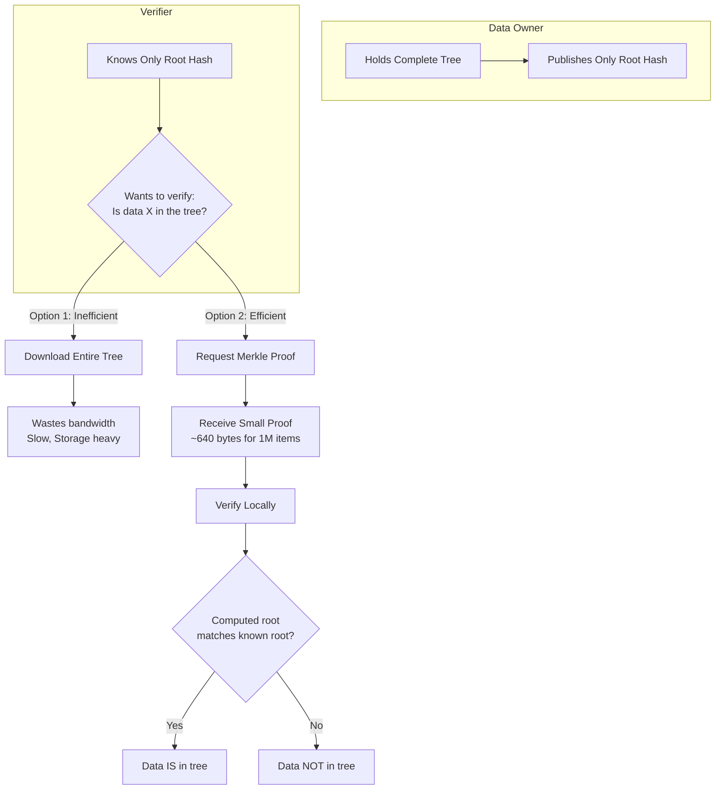
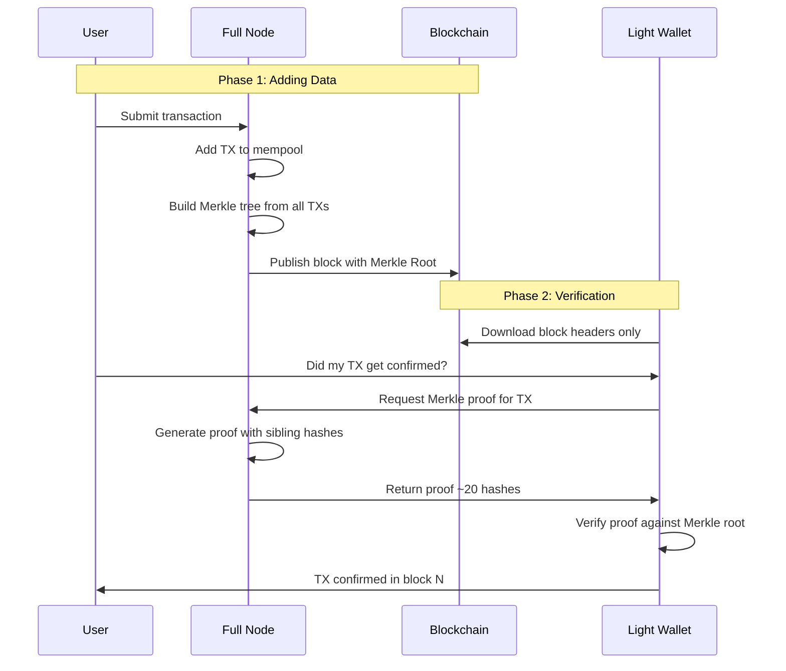
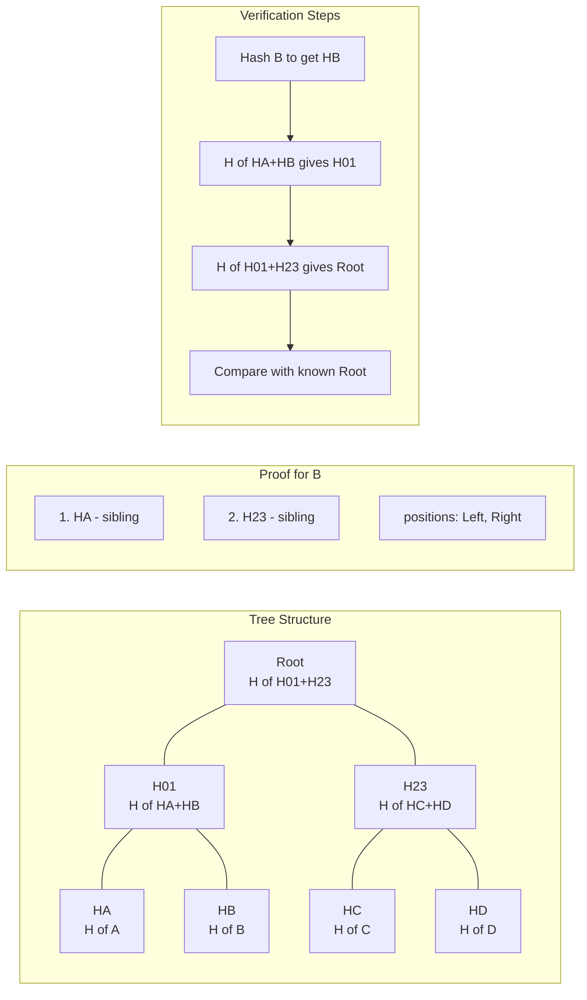
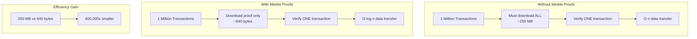
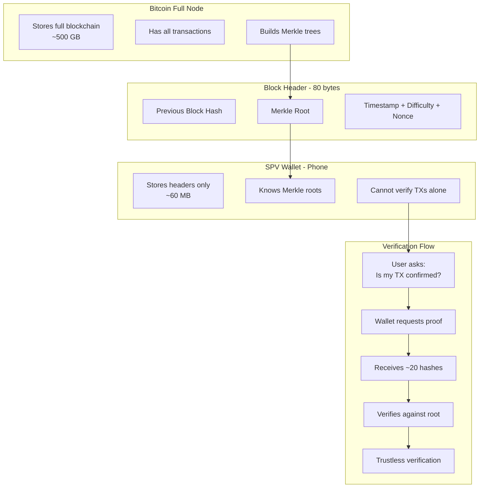

# Merkle Trees

## Status

[](https://github.com/deruelle/merkle-trees/actions/workflows/rust.yml)
[](https://codecov.io/github/deruelle/merkle-trees)

## Overview

Learning Rust through Implementation of Merkle Trees.
Merkle trees are widely used in blockchains, including Bitcoin and Ethereum.

## Representation


Merkle trees are a hash-based tree data structure in which every leaf node
is labelled with a data block and every non-leaf node is labelled with
the cryptographic hash of the labels of its child nodes.

A Merkle tree of n leaves has a height of log₂(n)

This design makes them extremely efficient for data verification.

### Invariants

* A leaf Node is raw data that gets hashed inside the Merkle tree.
* Domain separation:
  * Leaves: H(0x00 || leaf_bytes)
  * Internal nodes: H(0x01 || left_hash || right_hash)
* Dealing with Odd Numbers of Nodes:
  * Duplicate the last hash
* Empty Input:
  * Return an Error

### Basics

* Level 0 (leaves, hashed): h0, h1, h2
* Level 1: H(h0, h1), H(h2, h2)
* Level 2 (Merkle root): H( H(h0,h1), H(h2,h2) )

A hash is 32 bytes and a level is a vector of hashes

## Merkle Proofs

A **Merkle proof** (or inclusion proof) allows you to prove that specific data
exists in the tree **without revealing the entire tree**. You only need the
sibling hashes along the path from the leaf to the root — O(log n) hashes.

### Adding Data to the Tree



### When Proofs Are Needed



### Blockchain Transaction Lifecycle



### Proof Structure

For a tree with 8 leaves, proving leaf "B" requires siblings along the path:



### Efficiency Comparison



### Real-World Example: Bitcoin SPV



## Configuration

### Linking

The project is configured to use mold linker for faster linking times via
`.cargo/config.toml`. The configuration uses `clang` with `-fuse-ld=mold` flag,
which allows mold to be used as the linker.

Install `mold` via:

```bash
sudo apt-get install clang mold
```

After installation, simply build your project normally:

```bash
cargo build
```

The mold linker will be used automatically for faster linking.

## Faster Inner Dev Loop

Install `cargo watch` via:

```bash
cargo install cargo-watch
```

Run locally with

```bash
cargo watch -x check -x test
```

### Code Coverage

```bash
rustup component add llvm-tools-preview
cargo install cargo-llvm-cov
```
